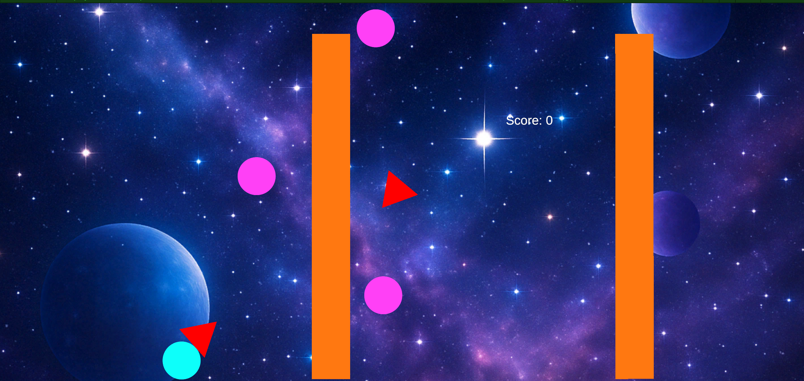

ゲーム制作技術総合実習 個人ワーク
（Circle, Triangle, Squareを使用した2Dゲーム）

# KatachiCrash

## ゲームの内容
ここにゲームの内容説明を記述する
三角、丸、四角の三つの形を切り替えてスコアを獲得していく。
丸状態で四角エネミーに触れると破壊、三角状態で丸に触れるとスコアを獲得、四角状態で三角エネミーに触れると防御することができる。
三角エネミーに四角状態以外で触れるとスコア減少。

## 操作説明
例
-A, W, S, Dキーで移動
-Spaceボタンでジャンプ
-Zで丸、Xで三角、Cで四角に変化

- 矢印キー、若しくはAとDキーで左右に砲台を移動する
- スペースキーを押すとビームを敵に向けて発射する
